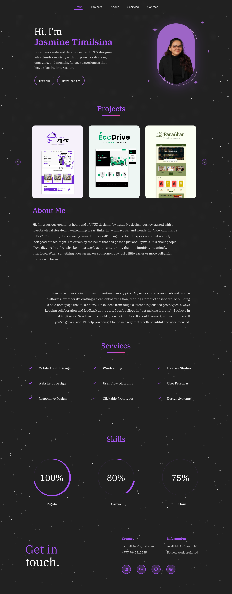

# 🌸 Jasmine Timilsina – UI/UX Portfolio Website

Welcome to the source code of my personal portfolio — a visual and functional reflection of my passion for crafting intuitive, clean, and meaningful user experiences.

## 📸 Website Preview

Here's how the live site looks:




---

## 🧩 Built With

- **HTML5** – Semantically structured and accessible markup
- **CSS3** – Custom styles with animation, gradients, responsive layout
- **JavaScript** – For interactive sparkle effects and UI behavior
- **Figma** – All designs prototyped before implementation

---

## 💼 Featured Projects

| Project | Description |
|--------|-------------|
| 🎒 [Hamro Asraya](https://www.figma.com/design/eOq34ChbEydTQNlQ47BytO/Hamro-Asraya?node-id=1047-345) | Verified hostel rental app for students in Nepal |
| 🚗 [EcoDrive](https://www.figma.com/design/OsfPVlRPpJcsKjLbsvt11j/EcoRental?node-id=89-16) | Car rental system with clean UI and location filters |
| 📚 [PanaGhar](https://www.figma.com/design/ovsJeIjiQDW6bSe1uw8yII/PanaGhar?node-id=11-338) | Book rental platform for academic students |

> Inspired by real-life usability challenges faced by Nepali students and professionals.

---

## 🌈 Design Aesthetic

- Color palette: Deep neutrals with accents of **lavender**, **olive**, and soft **plum**.
- Typography: [IBM Plex Serif](https://fonts.google.com/specimen/IBM+Plex+Serif) for elegance and legibility.
- Effects: Floating sparkles powered by `canvas`, CSS hover lifts, and micro animations.

---

## 🌿 Fun Fact

Yes, I'm a **plantkeeper** too 🌱 — my creative space is full of succulents and leafy friends that thrive next to my Figma drafts and browser tabs.

---

## 🚀 How to Run

Clone this repository and open `index.html` in your browser.

```bash
git clone https://github.com/jasminetma/portfolio.git
cd portfolio
```

Alternatively, deploy with:
- Vercel
- Netlify
- GitHub Pages

---

## 📮 Contact

- 📧 jastimilsina@gmail.com  
- 🌐 [LinkedIn](https://www.linkedin.com/in/jasminetimilsina)  
- 🎨 [Behance](https://www.behance.net/jasminetimilsi)  
- 💻 [GitHub](https://github.com/jasminetma)

---

## ⭐ Credits

- UI Concepts & Design: Jasmine Timilsina  
- Sparkle Animation: Vanilla JS + `canvas`  
- Icons: Font Awesome  
- Fonts: Google Fonts

---

> *“Design isn’t just about pixels. It’s about people.”*